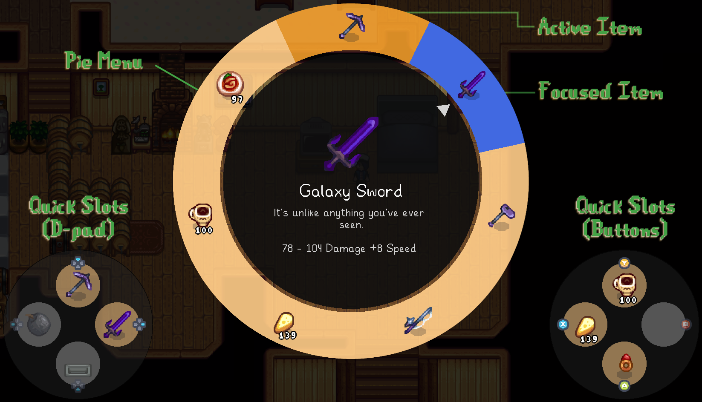
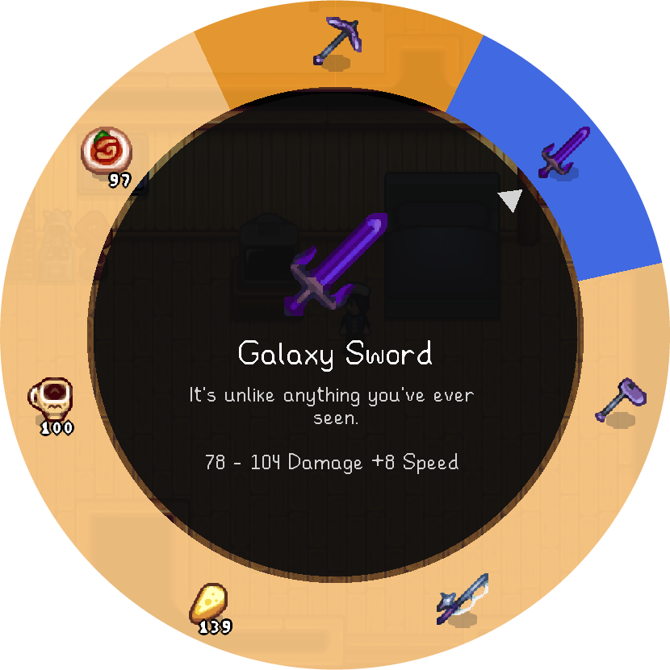
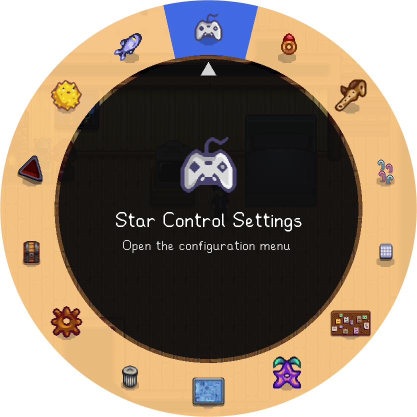
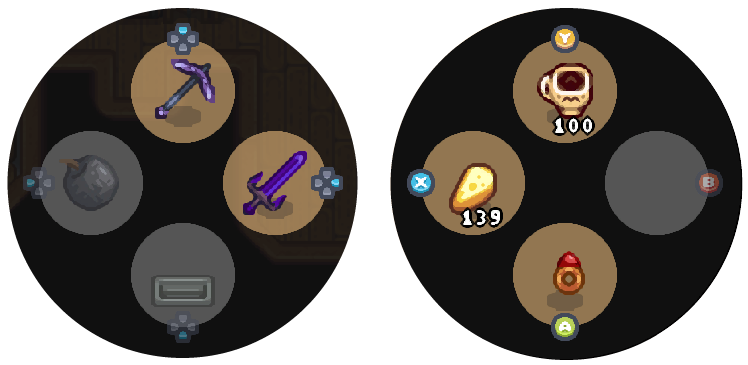

# Controller HUD

The controller HUD, or controller overlay, is the full-screen overlay shown when either of the menu hotkeys are pressed (default: :prompts-left-trigger:{.medium} or :prompts-right-trigger:{.medium}).

When visible, the overlay always includes one [pie menu](#pie-menus) and both [quick action](#quick-actions) groups.

## Pie Menus

The [pie menu](https://en.wikipedia.org/wiki/Pie_menu), AKA radial menu, is an ideal design for analog-stick based controllers because the menu's own layout mirrors the layout of the primary pointing device—the controller's analog stick.

|               Inventory Menu (Item Wheel)               |            Mod Menu (Mod Wheel)             |
| :-----------------------------------------------------: | :-----------------------------------------: |
|  |  |

### Types

There are two pie menus in Star Control: the **Inventory Menu** or *Item Wheel*, and the **Mod Menu** or *Mod Wheel*, both pictured above.

Both menus have the same look and feel; they differ only by their contents:

- The Inventory Menu (Default: :prompts-left-trigger:{.medium}) shows what is currently in your character's backpack. One backpack row corresponds to a single page, changed with :prompts-left-button:{.medium} and :prompts-right-button:{.medium}.
- The Mod Menu (Default: :prompts-right-trigger:{.medium}) shows the [mod actions you have set up](configuration.md#actions), as well as any pages added by other mods via the [API](api.md).

These are the only two pie menus. Either or both of the menus can be disabled in the [control settings](configuration.md#controls) by removing their respective button bindings, and the Mod Menu can be set up with any arbitrary collection of pages and any desired items on each page, but it is not possible to have two distinct Mod Menus.

### Components

In Star Control's terminology, the contents of a pie menu are:

- The **outer ring**, where individual selectable items appear.
    - One or more items may be **selected** or **active**, which in the case of the Inventory menu means "held in hand". These items appear with an orange background when using the default [styles](configuration.md#styles).
    - At most one item may be **focused**, which is highlighted in blue when using default styles. This is the item that the analog stick is pointing to; if the stick is centered, then no item is focused.
- The **inner ring** or **spotlight**, where details of the focused item are shown, including its name and detailed description if available.
- The **cursor** which points in the exact direction of the analog stick. This has a similar function as item focus, but is more precise, so you can see if the cursor is near the edge of an item and therefore likely to "slip" when activating.

### Activation

To avoid confusion with the "selected" item, which per above means roughly "held in hand", items from the pie menu or any other menu in Star Control are **activated** by pressing one of the buttons :prompts-a:{.medium} or :prompts-x:{.medium}, which perform the **primary** and **secondary** actions, respectively.

In order to provide flexibility to third-party mods, the words *primary* and *secondary* do not have a fixed meaning. However, for items that Star Control itself sets up:

- The **primary action** for an **Inventory** item is to consume it if it is a consumable item (food, drink, totem, staircase, etc.), and to select it otherwise.
- The **secondary action** for an **Inventory** item is always to select it, regardless of the type of item.
- **Mod Menu** items that you [set up yourself](configuration.md#actions) typically do not distinguish between the primary vs. secondary action, and do the same thing in both cases, i.e. simulating a key press to open a different mod's menu or trigger its behavior.
- **Mod Menu** items that are set up by **other mods** (via the [API](api.md)) **may** have alternate secondary actions, but this is up to the individual mod author to decide.

## Quick Actions

While [pie menus](#pie-menus) excel at making a large number of items easy to navigate, they aren't the best for every situation. Many players will find that they rely pretty heavily on a small set of core tools, consumables and mod shortcuts, and need to access them very quickly and precisely. The image below shows a setup optimized for a Skull Cavern run, or more generally "mining + combat":

Fairly typical min-max mining strategy involves the pickaxe, a melee weapon, lots of bombs and staircases, an assortment of healing and buff items, and sometimes a utility mod or two such as [Swap Rings](https://www.nexusmods.com/stardewvalley/mods/21205). These can all fit in the 8 quick slots: one for each d-pad direction, and one for each primary button.

A more farming-centric setup might include the hoe, watering can, fertilizer and scythe on one side, along with mod actions to show overlays for unwatered/unfertilized crops, scarecrow and sprinkler ranges, etc. on the other side.

Quick actions/quick slots have the following properties:

- They are performed **while the controller overlay is shown**, i.e. while a pie menu is visible, by pressing the associated button (:prompts-dpad-any: or :prompts-a:/:prompts-b:/:prompts-x:/:prompts-y:) **without** pointing the analog stick.
- They stay bound, in the same position, even if the action is no longer possible, e.g. if you run out of the item in your inventory. In this instance, as shown above, they will display grayed out, and flash red if you try to activate one.
- The [type of activation](#activation) is determined by how you set up the slot—i.e. you choose in the [configuration](configuration.md#quick-actions) whether to perform the primary or secondary action, and also whether to display a confirmation dialog first.
- If you do not have the original item, but have a *similar* item, it will use that instead. For example, if the Copper Pickaxe is in one slot and you upgrade it to the Steel Pickaxe, then the slot will use the Steel Pickaxe. Similarly, the image above shows the Galaxy Sword in the right d-pad slot, but if that specific weapon is not available, it will search for other melee weapons in your inventory and choose the one with the best stats.

These attributes are ideal for actions that will be performed _frequently_ but not _constantly_. For the latter, there are [instant actions](instant-actions.md) instead. Quick actions are significantly more customizable but take longer to set up and an extra button press to activate; they are meant to be set up once and used throughout an entire run or play session.

A secondary use of quick actions is to restore semi-common vanilla functionality for buttons remapped by instant actions. For example, if you've decided to remap the :prompts-b:{.medium} button to some specific tool, then you might add a quick slot for opening the vanilla main menu, or the map, both of which are provided as Library Actions in Star Control.