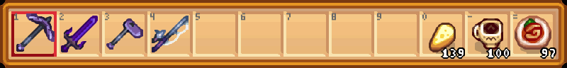

# Home

The only controller mod you'll ever need.[^1]

---

Star Control—short for **Star**dew **Control**lers—is a total redesign of Stardew Valley's serviceable but clunky controller input system.

What does "total redesign" mean? A picture is worth a thousand words, so we'll lead with those; instead of being limited to this:

You have access to this:

## Features

Compared to vanilla Stardew controls, in Star Control:

- Every button has a unique and useful function.
- (Almost) every input is configurable and remappable.
- You can use items directly from the menus, instead of having to press several buttons to select, use and then confirm.
- Most modded features can be accessed and used with your gamepad, even if the mod author didn't design for it.

The key features are:

- [Pie Menus](controller-hud.md#pie-menus)[^2] for your Inventory and Mod Actions that can be navigated with the analog stick;
- Configurable [Quick Action](controller-hud.md#quick-actions) slots that can be activated with a single button press, without using the stick, and remember your setting even when the item is no longer in your inventory or the action is no longer possible;
- Configurable [Instant Actions](instant-actions.md), sometimes called "Zelda-style" controls, in which you can bind a specific tool or item to a controller button to perform its action; for example, :prompts-x: to swing with pickaxe, :prompts-y: to slash with sword, and :prompts-b: to chop with axe. The sky's the limit.
- An expansive in-game [configuration system](configuration.md) that can customize nearly every aspect of the mod and is itself designed for gamepad navigation.

## Requirements

Using Star Control requires:

- A valid Stardew Valley install with SMAPI and Stardew UI (see [setup](#setup) below);
- Stardew-compatible gamepad controller, such as any Xbox controller;
- Screen resolution or window size of at least 1080p (1920x1080).
    - **720p is not and will not be supported**.
    - 1080p with high magnification (UI scale) may also appear cut off.

## Setup

Star Control works out of the box, though many of its more powerful features require additional setup. These steps will get you up and running; afterward, head on over to the [configuration](configuration.md) pages to learn how to customize.

!!! warning "Important"

    Users of `RadialMenu 0.2.2` or earlier **must manually uninstall `RadialMenu`** before installing Star Control, i.e. delete the `RadialMenu` folder from the Mods directory and/or mod manager, or move it to a backup location. Otherwise, the two mods may conflict and neither mod will function correctly.

    Star Control is **not backward-compatible** with clients of the older Radial Menu API. Mods designed to work with the older Radial Menu mod, such as [Sword and Sorcery](https://www.nexusmods.com/stardewvalley/mods/12369), will not work with Star Control until they receive updates. Please ensure that your other mods are compatible with the new version before upgrading.

Installation steps:

1. Install [SMAPI](https://smapio.io) and set up your game for mods, per the [Modding: Player's Guide](https://stardewvalleywiki.com/Modding:Player_Guide/Getting_Started) instructions.
2. Download and install [Stardew UI](https://www.nexusmods.com/stardewvalley/mods/28870).
3. Download the latest release from [Nexus Mods](https://www.nexusmods.com/stardewvalley/mods/25257) or [GitHub](https://github.com/focustense/StardewControllers/releases).
4. Open the .zip file and extract the `StarControl` folder into your `Stardew Valley\Mods` folder. You can also use a mod manager such as Stardrop.
5. Launch the game and load a save.

Basic controls once the mod is installed (all can be customized):

- Hold :prompts-left-trigger:{.big} to open the Inventory Pie Menu,
- Hold :prompts-right-trigger:{.big} to open the Mod Actions menu, which initially will only have one item, the [Star Control Settings](configuration.md).
- With either menu open, use :prompts-left-analog:{.big} to focus an item. The game is paused during selection.[^3]
- When an item is focused (highlighted), press :prompts-a:{.big} to use it or :prompts-x:{.big} to select (hold) it.
- If a menu has multiple pages, use :prompts-left-button:{.big} and :prompts-right-button:{.big} to navigate while the menu is open.

## Contact

Found a bug, or have questions? You can reach the author in one of the following ways:

- Ping **@focustense** in the [Stardew Valley Discord](https://discord.com/invite/stardewvalley) or start a thread in `#modded-tech-support`.
- Start a [discussion](https://github.com/focustense/StardewControllers/discussions) or create an [issue](https://github.com/focustense/StardewControllers/issues) on the project's GitHub.

All bug reports require a [SMAPI log](https://smapi.io/log) to investigate. Please turn on the "Everything" option in the mod's [debug settings](configuration.md#debug) while capturing your log; don't forget to turn it off afterwards as it produces a large amount of output.

[^1]: Statements have not been evaluated by the FDA. This product is not intended to diagnose, treat, cure or prevent any disease, except for throwing your controller out of a second-floor window after the 357th time you landed on the wrong tool or had to reorganize your inventory to work around the constant button thrashing.

[^2]: AKA _Radial Menu_ (the mod's former title), or _Wheel_ as in "Item Wheel" or "Mod Wheel".

[^3]: Co-op games require all players to be paused in order to pause the game, and networked multiplayer may require additional mods such as Pause Time In Multiplayer.